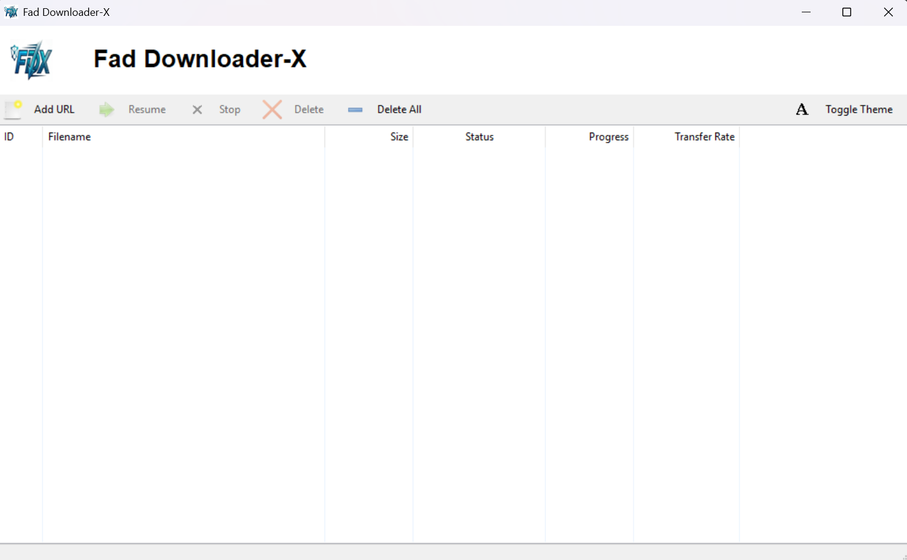
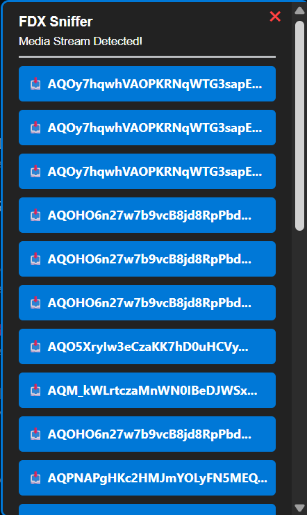
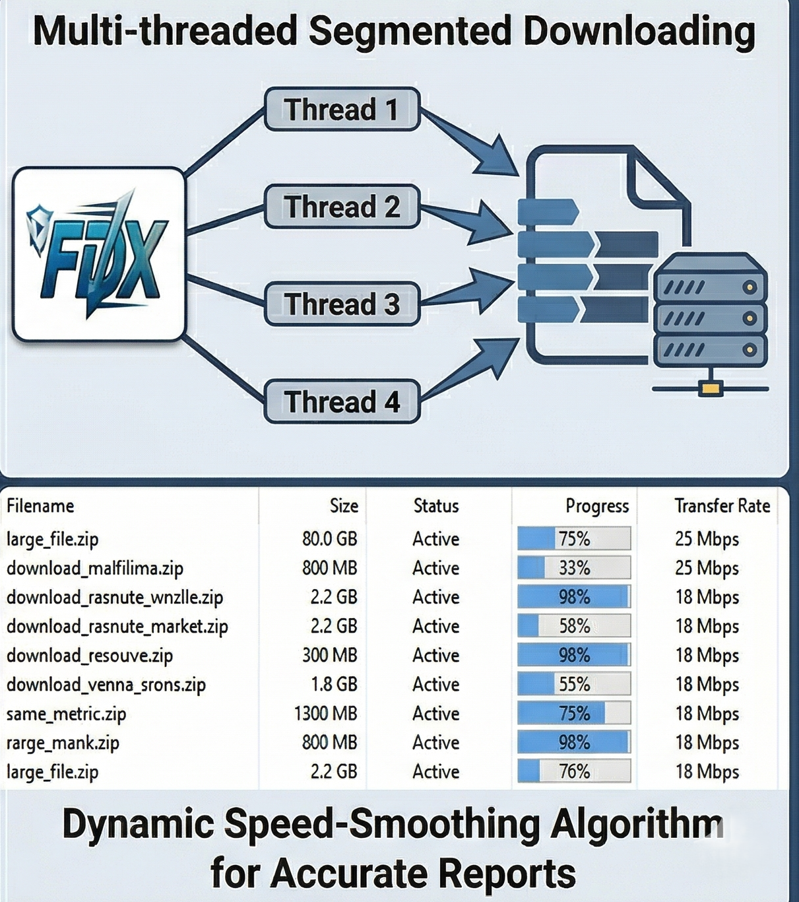

<div align="center">


# 📥 Fad Downloader-X (FDX)

**The Ultimate High-Speed C++ Download Manager & Advanced Media Sniffer.**

[](https://en.cppreference.com/)
[](#)
[](https://curl.se/)
[](#)

*Engineered for power users who demand maximum bandwidth saturation and seamless browser integration.*

[⬇️ Download Latest Release](#-installation) • [🐛 Report Bug](#) • [✨ Request Feature](#)

</div>

---

## 👁️ Visual Showcase


<details>
<summary><b>Click to view detailed screenshots</b></summary>

### The Dark-Mode Dashboard


### The Chrome Sniffer Panel


### Multi-Threaded Progress Tracker


</details>

---

## ✨ Premium Features

Fad Downloader-X goes beyond basic downloading, offering a deeply integrated architecture designed for absolute performance and reliability.

### ⚡ Multi-Threaded Engine
| Feature | Description |
| :--- | :--- |
| **Dynamic Slicing** | Slices files into optimized chunks and opens simultaneous HTTP connections via `libcurl` for maximum bandwidth saturation. |
| **Robust Range Probing** | Safely requests `Range: 0-` to flawlessly support complex CDN architectures like AWS S3 and GitHub Releases. |
| **Smart Redirect Parsing** | Tracks 302/301 redirects to their final destination, bypassing obfuscation to extract the true filename. |

### 🕵️‍♂️ Advanced Browser Sniffing
* **Top-Level Frame Routing:** Penetrates hidden embedded video iframes and projects the capture UI safely onto your main browser window.
* **Background Interception:** Instantly cancels Chrome's slow default downloads and securely routes the URL to the C++ engine.

### ⚙️ Workflow & Control
* **Anti-Bombing Queue:** A strict `%TEMP%` debounce queue prevents UI thread locking or system freezes during massive link drops.
* **Kernel Isolation:** Uses a global Windows `CreateMutexA` lock to ensure perfect Native Messaging IPC across all Chrome security sandboxes.

---

## 🖱️ Browser Integration & Controls

Control the engine seamlessly directly from your web browser.

| Action | Trigger | Behavior |
| :--- | :---: | :--- |
| **Context Menu Send** | `Right-Click` | Send any highlighted link, image, or video directly to the FDX queue. |
| **Standard Intercept** | `Auto` | Automatically cancels native Chrome `.exe`/`.zip`/`.rar` downloads and routes them to FDX. |
| **Media Stream Capture** | `Sniffer UI` | Detects hidden `.m3u8` or `.mp4` background network traffic and pops up a 1-click capture button. |
| **DOM Video Overlay** | `Hover` | Injects a floating blue "Download" button directly onto HTML5 `<video>` tags. |

---

## 🛠️ Architecture & Tech Stack

This project was built from the ground up to maximize the efficiency of Windows native APIs and the Chromium extension pipeline.

<div align="center">

| Domain | Core Technology | Implementation |
| :--- | :--- | :--- |
| **Language** | ISO C++17 | Core engine threading, chunking, and atomic state management. |
| **Networking** | `libcurl` (WinSSL) | Highly concurrent HTTP/HTTPS chunk requests and header parsing. |
| **GUI** | `wxWidgets` 3.2+ | Native Win32 UI rendering with dynamic Dark/Light mode support. |
| **Extension** | Manifest V3 / ES6 | `chrome.webRequest` network sniffing and DOM mutation observers. |
| **IPC Bridge** | Native Messaging | Secure `stdio` JSON communication between Chrome and C++. |
| **OS Locking** | Windows API | Global Kernel Mutex (`CreateMutexA`) for strict instance control. |

</div>

---

## 🚀 Installation

### For End Users
1. Navigate to the **[Releases](#)** tab.
2. Download the latest `FDX_Setup_v1.0.exe`.
3. Run the installer (this automatically configures the Native Messaging Registry keys).
4. Open Chrome and go to `chrome://extensions/`. Turn on **Developer Mode**.
5. Click **Load Unpacked** and select the `Chrome Extension` folder located in your new installation directory.

### For Developers (Building from Source)
You will need **Visual Studio 2022**, **wxWidgets**, and **libcurl**.

```bash
# 1. Clone the repository
git clone [https://github.com/Fahad23104/FDX.git](https://github.com/Fahad23104/FDX.git)

# 2. Open the solution
# Open GUI_IDM.sln in Visual Studio 2022.

# 3. Configure and Build
# Ensure Configuration is set to Release | x64.
# Link your local wxWidgets and libcurl directories in Project Properties.
# Press Ctrl + Shift + B to build the engine.